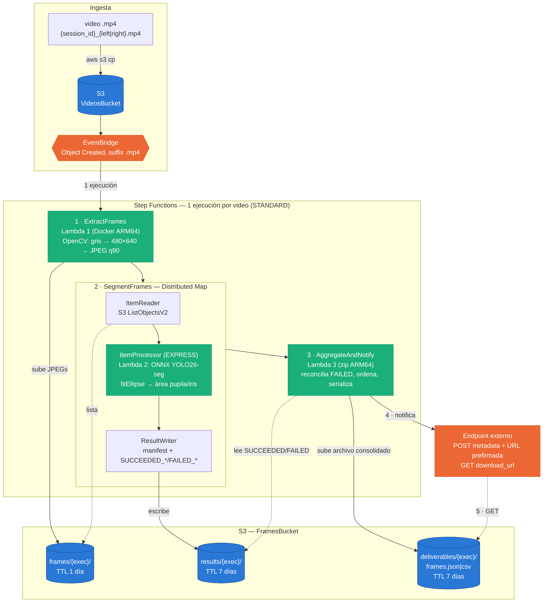

# Arquitectura del pipeline

Diagrama del flujo serverless de procesamiento de videos oculares. Detalle
completo (parámetros, IAM, variables de entorno) en [README.md](README.md#diagrama-de-arquitectura)
y en la especificación estado por estado del state machine.

## Notas de lectura del diagrama

- **Sin base de datos intermedia**: el estado del job viaja en el JSON de
  Step Functions (`$.job`); la Lambda 2 nunca escribe a ningún lado, solo
  `return` — el `ResultWriter` del Distributed Map junta los resultados.
- **`ToleratedFailurePercentage: 100`**: el Map siempre completa, incluso si
  fallan todas sus ejecuciones hijas; la reconciliación en Lambda 3
  (`FAILED_*.json` → métricas en 0) garantiza que el total de registros
  siempre coincida con `total_frames`.
- **El endpoint nunca recibe los datos de los frames en el POST**, solo
  metadata + un link prefirmado — desacopla el tamaño de la notificación del
  tamaño del video.
- Líneas punteadas = lectura; líneas sólidas = escritura o invocación.
